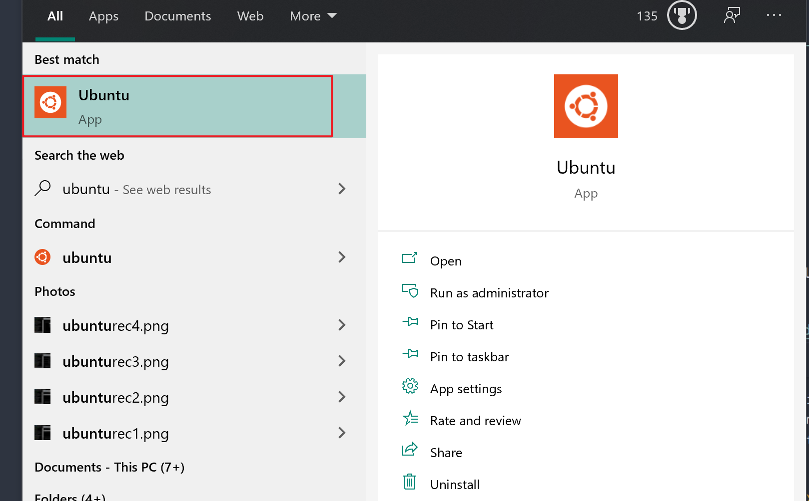
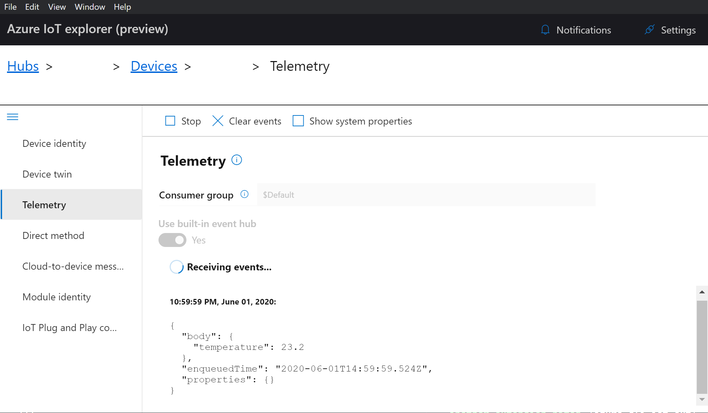
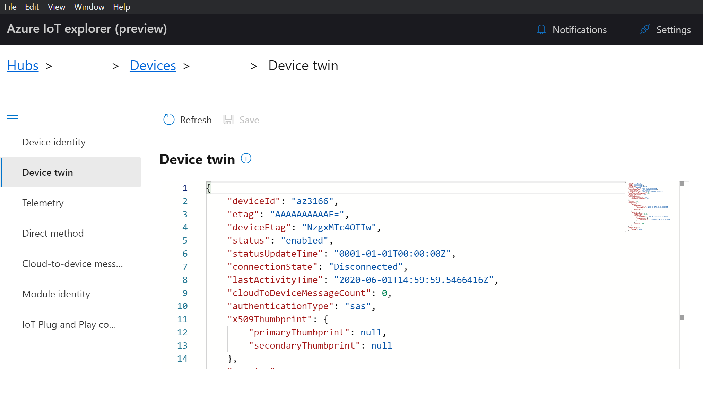
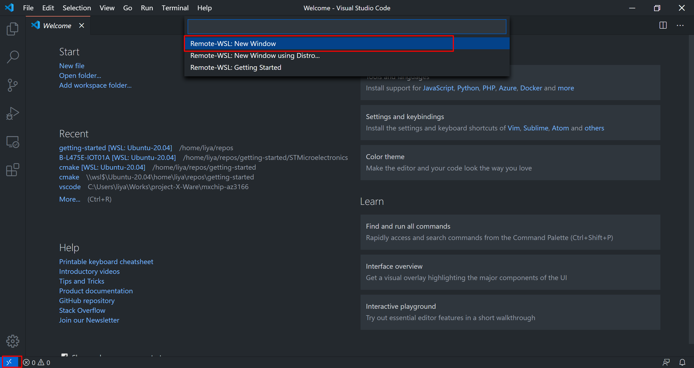
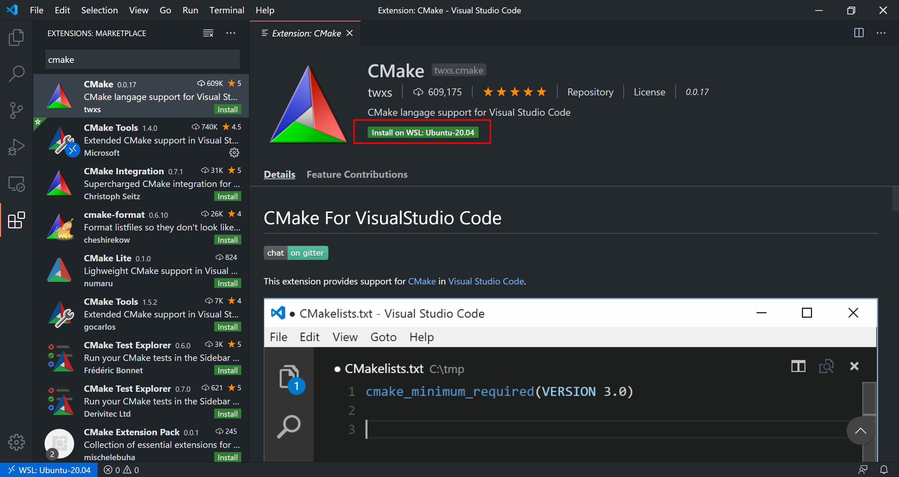
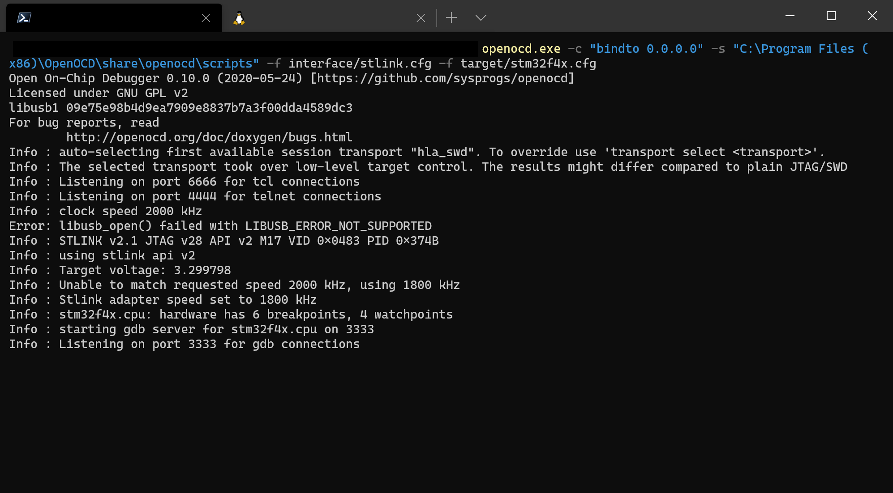

# Getting started with the MXChip AZ3166 IoT DevKit

**Total completion time**:  45 minutes

In this tutorial you use Azure RTOS to connect the MXChip AZ3166 IoT DevKit (hereafter, the IoT DevKit) to Azure IoT. The article is part of the series [Getting started with Azure RTOS](https://go.microsoft.com/fwlink/p/?linkid=2129824). The series introduces device developers to Azure RTOS, and shows how to connect several device evaluation kits to Azure IoT.

You will complete the following tasks:

* Install a set of embedded development tools for programming the IoT DevKit in C
* Build an image and flash it onto the IoT DevKit
* Create an Azure IoT hub and securely connect the IoT DevKit to it
* Use Azure IoT Explorer to view device telemetry, view properties, and invoke cloud-to-device methods
* Use VS Code, OpenOCD and GDB to debug the firmware

## Prerequistes

* A PC running Microsoft Windows (Windows 10 recommended)
* [Ubuntu 18.04 or above installed in WSL2](https://docs.microsoft.com/windows/wsl/wsl2-install) on Windows 10. You will set up your development environment in it.
* If you don't have an Azure subscription, [create one for free](https://azure.microsoft.com/free/?WT.mc_id=A261C142F) before you begin.
* Hardware

    > * The [MXChip AZ3166 IoT DevKit](https://aka.ms/iot-devkit) (IoT DevKit)
    > * Wi-Fi 2.4 GHz
    > * USB 2.0 A male to Micro USB male cable

## Prepare the development environment

To set up your development environment, first you clone a GitHub repo that contains all the assets you need for the tutorial. Then you install a set of programming tools.

#### Prepare the toolchain in WSL2

1. In Windows 10, launch Ubuntu bash command line.

    

1. Download and untar [GCC ARM Toolchain in Linux](https://developer.arm.com/tools-and-software/open-source-software/developer-tools/gnu-toolchain/gnu-rm/downloads).

    ```bash
    cd ~

    wget -c "https://armkeil.blob.core.windows.net/developer/Files/downloads/gnu-rm/9-2020q2/gcc-arm-none-eabi-9-2020-q2-update-x86_64-linux.tar.bz2"

    tar xvjf ./gcc-arm-none-eabi-9-2020-q2-update-x86_64-linux.tar.bz2

    sudo mv ./gcc-arm-none-eabi-9-2020-q2-update /opt/.
    ```

1. Add GCC to the path.

    ```bash
    nano ~/.bashrc
    ```

    Find line with `PATH=...` or add a new line to add the GCC binary path into it:

    ```bash
    PATH="/opt/gcc-arm-none-eabi-9-2020-q2-update/bin:$PATH"
    ```

    Save and close the file (`Ctrl+X`). Then source the `.bashrc` to make it effective.

    ```bash
    source ~/.bashrc

    arm-none-eabi-gcc --version
    ```

1. Install Git, CMake and Ninja build system.

    ```bash
    sudo apt update && sudo apt install -y git cmake ninja-build

    cmake --version
    ```
    Make sure the CMake version is above 3.14.0. If not, you can follow [this guide](https://apt.kitware.com/) to install the latest CMake.

### Clone the repo for the tutorial

Clone the following repo to download all sample device code, setup scripts, and offline versions of the documentation. If you previously cloned this repo in another tutorial, you don't need to do it again.

To clone the repo, run the following command in Ubuntu bash command line:

```
git clone --recursive https://github.com/azure-rtos/getting-started
```

### Install the tools

* [Azure IoT Explorer](https://github.com/Azure/azure-iot-explorer/releases) cross platform utility for managing IoT Hub devices and view communication between device and IoT Hub.
* [Termite](https://www.compuphase.com/software_termite.htm) terminal for viewing log output from COM port.

## Prepare Azure resources

To prepare Azure cloud resources and connect a device to Azure, you can use Azure CLI. There are two ways to access the Azure CLI: by using the Azure Cloud Shell, or by installing Azure CLI locally.  Azure Cloud Shell lets you run the CLI in a browser so you don't have to install anything.

Use one of the following options to run Azure CLI.  

If you prefer to run Azure CLI locally:

1. If you already have Azure CLI installed locally, run `az --version` to check the version. This tutorial requires Azure CLI 2.5.1 or later.
1. To install or upgrade, see [Install Azure CLI](https://docs.microsoft.com/cli/azure/install-azure-cli?view=azure-cli-latest). If you install Azure CLI locally, you can run CLI commands in the **GCC Command Prompt**, Git Bash for Windows, or Powershell.

If you prefer to run Azure CLI in the browser-based Azure Cloud Shell:

1. Use your Azure account credentials to sign into the Azure Cloud shell at https://shell.azure.com/.
    > Note: If this is the first time you've used the Cloud Shell, it prompts you to create storage, which is required to use the Cloud Shell.  Select a subscription to create a storage account and Microsoft Azure Files share.
1. Select Bash or Powershell as your preferred CLI environment in the **Select environment** dropdown. If you plan to use Azure Cloud Shell, keep your browser open to run the Azure CLI commands in this tutorial.

    

### Create an IoT hub

You can use Azure CLI to create an IoT hub that handles events and messaging for your device.

To create an IoT hub:

1. In your CLI console, run the [az extension add](https://docs.microsoft.com/cli/azure/extension?view=azure-cli-latest#az-extension-add) command to add the Microsoft Azure IoT Extension for Azure CLI to your CLI shell. The IOT Extension adds IoT Hub, IoT Edge, and IoT Device Provisioning Service (DPS) specific commands to Azure CLI.

   ```azurecli
   az extension add --name azure-iot
   ```

1. Run the [az group create](https://docs.microsoft.com/cli/azure/group?view=azure-cli-latest#az-group-create) command to create a resource group. The following command creates a resource group named *MyResourceGroup* in the *eastus* region.
    > Note: Optionally, to set an alternate `location`, run [az account list-locations](https://docs.microsoft.com/cli/azure/account?view=azure-cli-latest#az-account-list-locations) to see available locations. Then specify the alternate location in the following command in place of *eastus*.

    ```azurecli
    az group create --name MyResourceGroup --location eastus
    ```

1. Run the [az iot hub create](https://docs.microsoft.com/cli/azure/iot/hub?view=azure-cli-latest#az-iot-hub-create) command to create an IoT hub. It might take a few minutes to create an IoT hub.

    *YourIotHubName*. Replace this placeholder below with the name you chose for your IoT hub. An IoT hub name must be globally unique in Azure. This placeholder is used in the rest of this tutorial to represent your unique IoT hub name.

    ```azurecli
    az iot hub create --resource-group MyResourceGroup --name {YourIoTHubName}
    ```

    > Note: The Basic tier is **not supported** by this guide as it requires cloud-to-device communication.

1. After the IoT hub is created, view the JSON output in the console, and copy the `hostName` value from the following named field to a safe place. You use this value in a later step.

### Register a device

In this section, you create a new device instance and register it with the Iot hub you created. You will use the connection information for the newly registered device to securely connect your physical device in a later section.

To register a device:

1. In your console, run the [az iot hub device-identity create](https://docs.microsoft.com/cli/azure/ext/azure-cli-iot-ext/iot/hub/device-identity?view=azure-cli-latest#ext-azure-cli-iot-ext-az-iot-hub-device-identity-create) command. This creates the simulated device identity.

    *YourIotHubName*. Replace this placeholder below with the name you chose for your IoT hub.

    *MyMXChipDevice*. You can use this name directly for the device in CLI commands in this tutorial. Optionally, use a different name.

    ```azurecli
    az iot hub device-identity create --device-id MyMXChipDevice --hub-name {YourIoTHubName}
    ```

1. After the device is created, view the JSON output in the console, and copy the `deviceId` and `primaryKey` values to use in a later step.

Confirm that you have the copied the following values from the JSON output to use in the next section:

> * `hostName`
> * `deviceId`
> * `primaryKey`

## Prepare the device

To connect the IoT DevKit to Azure, you'll modify a configuration file for Wi-Fi and Azure IoT settings, rebuild the image, and flash the image to the device.

### Add configuration

1. In VSCode or any other text editor, edit the file `getting-started/MXChip/AZ3166/app/azure_config.h` to set the Wi-Fi constants to the following values from your local environment.

    |Constant name|Value|
    |-------------|-----|
    |`WIFI_SSID` |{*Your Wi-Fi ssid*}|
    |`WIFI_PASSWORD` |{*Your Wi-Fi password*}|
    |`WIFI_SECURITY` |{*Your Wi-Fi security type*}|
    |`WIFI_COUNTRY` |{*Your Wi-Fi is located in a country*}|

1. Edit the same file to set the Azure IoT device information constants to the values that you saved after you created Azure resources.

    |Constant name|Value|
    |-------------|-----|
    |`IOT_HUB_HOSTNAME` |{*Your Iot hub hostName value*}|
    |`IOT_DEVICE_ID` |{*Your deviceID value*}|
    |`IOT_PRIMARY_KEY` |{*Your primaryKey value*}|

    > The IoT Hub host name format is `{Your IoT Hub name}.azure-devices.net`.

### Build the image

We will build the image in Ubuntu of WSL2.

1. Open Ubuntu bash command line.

1. Build the project with the script that invokes CMake and Ninja.

    ```bash
    cd ./getting-started/MXChip/AZ3166/

    ./rebuild.sh
    ```

1. After the build completes, confirm that a binary file was created in the following path

    ```bash
    getting-started/MXChip/AZ3166/build/app/mxchip_azure_iot.bin
    ```

### Flash the image

1. Download and unzip [OpenOCD for Windows](https://gnutoolchains.com/arm-eabi/openocd/) to `C:\Program Files(x86)\OpenOCD`. Add `openocd.exe` path in Windows Path Environment Variables.

1. Install ST-Link driver within unzipped OpenOCD folder by running `OpenOCD/drivers/ST-Link/stlink_winusb_install.bat`.

1. Connect the Micro USB cable to the Micro USB port on the IoT DevKit, and then connect it to your computer.

1. In File Explorer, find the IoT DevKit device connected to your computer. It is a driver labeled as **AZ3166**.

1. Copy the image file *mxchip_azure_iot.bin* that you created in the previous section, and paste it into the root folder of the IoT DevKit. The flashing process starts automatically.

    > Note: During the flashing process, the RED LED toggled on IoT DevKit. The process completes in a few seconds without further notification.

### Confirm device connection details

You can use the **Termite** utility to monitor communication and confirm that your device is set up correctly.
> Note: If you have issues getting your device to initialize or connect after flashing, see [Troubleshooting](../../docs/troubleshooting.md).

1. Open Device Manager and find the COM port for the MXChip IoT DevKit.

    

1. Start Termite and configure the COM port and settings as:

    * Baud rate: 115,200
    * Data bits: 8
    * Stop bits: 1

    Now you can view the DevKit is publishing sensor telemetry data to IoT Hub in every a few seconds.

    

## View telemetry

You can use Azure IoT Explorer to inspect the flow of telemetry from the device to Azure IoT.

1. In Azure IoT Explorer, select the device you just created from the list. Select **Telemetry** tab and select **Start** to to monitor telemetry from your device.

    

## View device properties

Using Azure IoT Explorer, you can inspect the properties on connected device.

1. In Azure IoT Explorer, select the device you just created from the list. Select **Device Twin** tab and select **Refresh** to to view the properties from your device.

    

## Debugging

You can debug the firmware application in VS Code using [OpenOCD](http://openocd.org/) and [GDB](https://www.gnu.org/software/gdb/).

### Install VS Code and extensions

1. Install [Visual Studio Code](https://code.visualstudio.com/) for Windows with [Remote - WSL](https://marketplace.visualstudio.com/items?itemName=ms-vscode-remote.remote-wsl) extension installed. This is for code editing and debugging with UI supported. Learn [Develop in WSL](https://code.visualstudio.com/docs/remote/wsl) if you are new to it.

1. Launch VS Code, click the left bottom corner to launch Remote command palette and select **Remote-WSL: New Window**.

    

1. In Extensions tab (`Ctrl+Shift+X`), search and install the following extensions in the WSL.

    * C/C++
    * CMake
    * Cortex-Debug

    

### Debugging using OpenOCD and GDB

1. In Windows command line or PowerShell, launch **openocd** server:

    ```cmd
    openocd -c "bindto 0.0.0.0" -s "C:\Program Files(x86)\OpenOCD\share\openocd\scripts" -f interface/stlink.cfg -f target/stm32f4x.cfg
    ```

    

1. Launch VS Code, click the left bottom corner to launch Remote command palette and select **Remote-WSL: New Window** to open the remote connection to WSL2.

1. Select **View > Terminal** to open the terminal of Ubuntu bash command line within VS Code. Then get  Windows host IP address in WSL2:

    ```bash
    cat /etc/resolv.conf
    ```

    Copy the IP adress of nameserver like the sample output:

    ```txt
    # [network]
    # generateResolvConf = false
    nameserver 172.17.176.1
    ```

1. Replace the IP address in `./getting-started/MXChip/AZ3166/.vscode/launch.json`.

    ```json
    // Get WSL2 IP from "cat /etc/resolv.conf"
    "gdbTarget": "{Your Windows host IP}:3333",
    ```

1. In VSCode, press `F5` or launch debug Run tab. Then select `mxchip_azure_iot`.

    

1. It will first flash the firmware onto the DevKit and start running it and stopped at `main()`. Press `F5` again or select continue to run the app.

    > If you get the error: *"arm-none-eabi-gdb: error while loading shared libraries: libncurses.so.5: cannot open shared object file: No such file or directory"*, it is due to the GDB has dependency on `libncurses` v5 but you may have a higher version of it. To solve this:
    > ```bash
    > ln -s /lib/x86_64-linux-gnu/libncurses.so.6.2 /lib/x86_64-linux-gnu/libncurses.so.5
    > ln -s /lib/x86_64-linux-gnu/libncurses.so.6.2 /lib/x86_64-linux-gnu/libtinfo.so.5
    > ```

View [Debug C++ in Visual Studio Code](https://code.visualstudio.com/docs/cpp/cpp-debug) to learn debugging in VS Code.


## Clean up resources

If you no longer need the Azure resources created in this tutorial, you can use the Azure portal to delete them.

If you continue to another tutorial in this getting started guide, you can keep the resources you've already created and reuse them.

> **Important**: Deleting a resource group is irreversible. The resource group and all the resources contained in it are permanently deleted. Make sure that you do not accidentally delete the wrong resource group or resources.

## Next Steps

In this tutorial you built a custom image that contains Azure RTOS sample code, and then flashed the image to the MXChip IoT DevKit device. You also used the Azure CLI to create Azure resources, connect the IoT DevKit securely to Azure, view telemetry, and send messages.

* For device developers, the suggested next step is to see the other tutorials in the series [Getting started with Azure RTOS](https://go.microsoft.com/fwlink/p/?linkid=2129824).
* If you have issues getting your device to initialize or connect after following the steps in this guide, see [Troubleshooting](../../docs/troubleshooting.md).
* To learn more about how Azure RTOS components are used in the sample code for this tutorial, see [Using Azure RTOS in the Getting Started Guides](../../docs/using-azure-rtos.md).
    >Note: Azure RTOS provides OEMs with components to secure communication and to create code and data isolation using underlying MCU/MPU hardware protection mechanisms. However, each OEM is ultimately responsible for ensuring that their device meets evolving security requirements.
