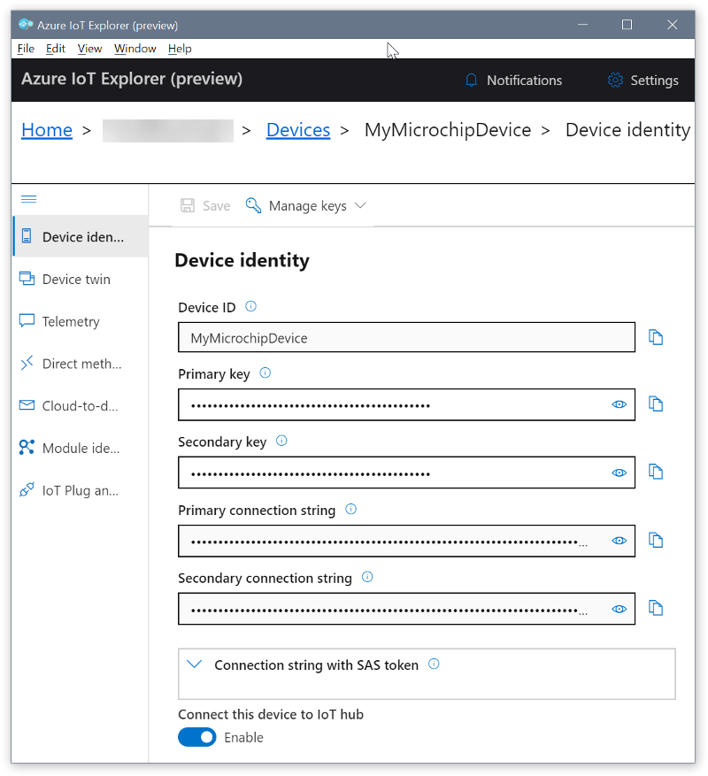
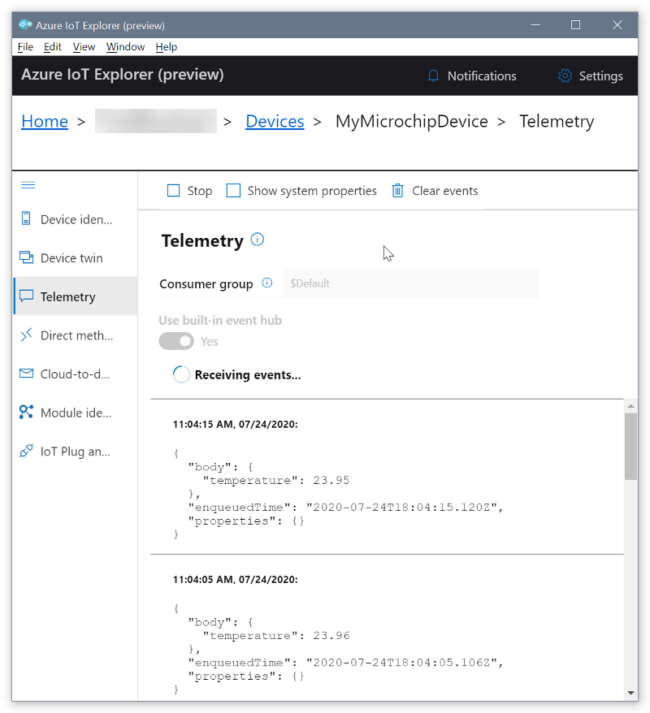
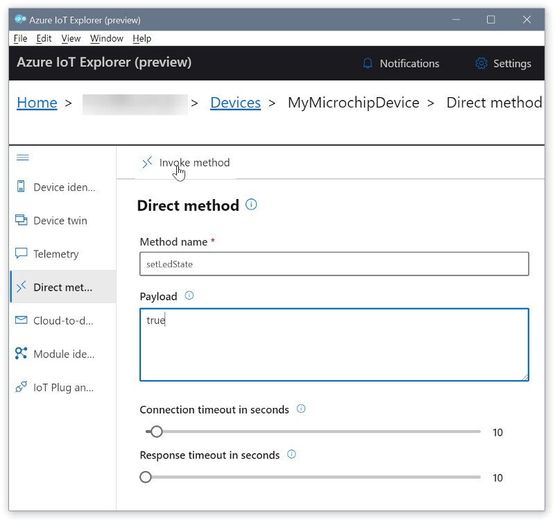

# Getting started with the Microchip ATSAME54-XPro evaluation kit

**Total completion time**: 35 minutes

In this tutorial you use Azure RTOS to connect the Microchip ATSAME54-XPro (hereafter, the Microchip E54) to Azure IoT.  The article is part of the series [Getting Started with Azure RTOS](https://go.microsoft.com/fwlink/p/?linkid=2129824). The series introduces device developers to Azure RTOS, and shows how to connect several device evaluation kits to Azure IoT.

You will complete the following tasks:

* Install a set of embedded development tools for programming the Microchip E54 in C
* Build an image and flash it onto the Microchip E54
* Use Azure CLI to create and manage an Azure IoT hub that the Microchip E54 will securely connect to
* Use Azure IoT Explorer to view properties, view device telemetry, and call cloud-to-device (c2d) methods

## Prerequisites

* A PC running Microsoft Windows (Windows 10 recommended)
* If you don't have an Azure subscription, [create one for free](https://azure.microsoft.com/free/?WT.mc_id=A261C142F) before you begin.
* [Git](https://git-scm.com/downloads)
* Hardware

    > * The [Microchip ATSAME54-XPro](https://www.microchip.com/developmenttools/productdetails/atsame54-xpro) (Microchip E54)
    > * USB 2.0 A male to Micro USB male cable
    > * Wired Ethernet access
    > * Ethernet cable
    > * Optional: [Weather Click](https://www.mikroe.com/weather-click) sensor. You can add this sensor to the device to monitor weather conditions. If you don't have this sensor, you can still complete this tutorial.
    > * Optional: [mikroBUS Xplained Pro](https://www.microchip.com/Developmenttools/ProductDetails/ATMBUSADAPTER-XPRO) adapter. Use this adapter to attach the Weather Click sensor to the Microchip E54. If you don't have the sensor and this adapter, you can still complete this tutorial.

## Prepare the development environment

To set up your development environment, first you clone a GitHub repo that contains all the assets you need for the tutorial. Then you install a set of programming tools.

### Clone the repo for the tutorial

Clone the following repo to download all sample device code, setup scripts, and offline versions of the documentation. If you previously cloned this repo in another tutorial, you don't need to do it again.

To clone the repo, run the following command:

```shell
git clone --recursive https://github.com/azure-rtos/getting-started
```

### Install the tools

The cloned repo contains a setup script that installs and configures the first set of required tools. After you run the setup script, you can install the remaining tools manually. If you installed these tools in another tutorial in the getting started guide, you don't need to do it again.

> Note: The setup script installs the following tools:

> * [GCC](https://developer.arm.com/tools-and-software/open-source-software/developer-tools/gnu-toolchain/gnu-rm): Compile
> * [CMake](https://cmake.org): Build
> * [Termite](https://www.compuphase.com/software_termite.htm): Monitor
> * [Azure IoT Explorer](https://github.com/Azure/azure-iot-explorer/releases): Cross-platform utility to  monitor and manage Azure IoT resources

To run the setup script:

1. From File Explorer, navigate to the following path in the repo and run the setup script named *get-toolchain.bat*:

    > *getting-started\tools\get-toolchain.bat*

    After the installation completes, the Azure IoT Explorer opens automatically. Keep the IoT Explorer open, you'll use it in later steps.

1. After the installation, open a new console window to recognize the configuration changes made by the setup script. Use this console to complete the remaining programming tasks in the tutorial. You can use Windows CMD, PowerShell, or Git Bash for Windows.
1. Run the following code to confirm that CMake version 3.14 or later is installed.

    ```shell
    cmake --version
    ```

To install the remaining tools:

1. Install [Atmel Studio 7](https://www.microchip.com/mplab/avr-support/atmel-studio-7). Atmel Studio is a device development environment that includes the tools to program and flash program the Microchip E54. For this tutorial, you use Atmel Studio only to flash the Microchip E54. The installation takes several minutes, and prompts you several times to approve the installation of components.

## Prepare Azure resources

To prepare Azure cloud resources and connect a device to Azure, you can use Azure CLI. There are two ways to access the Azure CLI: by using the Azure Cloud Shell, or by installing Azure CLI locally.  Azure Cloud Shell lets you run the CLI in a browser so you don't have to install anything.

Use one of the following options to run Azure CLI.  

If you prefer to run Azure CLI locally:

1. If you already have Azure CLI installed locally, run `az --version` to check the version. This tutorial requires Azure CLI 2.10.1 or later.
1. To install or upgrade, see [Install Azure CLI](https://docs.microsoft.com/cli/azure/install-azure-cli?view=azure-cli-latest). If you install Azure CLI locally, you can run CLI commands in the **GCC Command Prompt**, Git Bash for Windows, or PowerShell.

If you prefer to run Azure CLI in the browser-based Azure Cloud Shell:

1. Use your Azure account credentials to sign into the Azure Cloud shell at https://shell.azure.com/.
    > Note: If this is the first time you've used the Cloud Shell, it prompts you to create storage, which is required to use the Cloud Shell.  Select a subscription to create a storage account and Microsoft Azure Files share.
1. Select Bash or PowerShell as your preferred CLI environment in the **Select environment** dropdown. If you plan to use Azure Cloud Shell, keep your browser open to run the Azure CLI commands in this tutorial.

    

### Create an IoT hub

You can use Azure CLI to create an IoT hub that handles events and messaging for your device.

To create an IoT hub:

1. In your CLI console, run the [az extension add](https://docs.microsoft.com/cli/azure/extension?view=azure-cli-latest#az-extension-add) command to add the Microsoft Azure IoT Extension for Azure CLI to your CLI shell. The IOT Extension adds IoT Hub, IoT Edge, and IoT Device Provisioning Service (DPS) specific commands to Azure CLI.

   ```shell
   az extension add --name azure-iot
   ```

1. Run the [az group create](https://docs.microsoft.com/cli/azure/group?view=azure-cli-latest#az-group-create) command to create a resource group. The following command creates a resource group named *MyResourceGroup* in the *centralus* region.

    > Note: You can optionally set an alternate `location`. To see available locations, run [az account list-locations](https://docs.microsoft.com/cli/azure/account?view=azure-cli-latest#az-account-list-locations). For this tutorial we recommend using `centralus` as in the example CLI command. The IoT Plug and Play feature that you use later in the tutorial, is currently only available in three regions, including `centralus`.

    ```shell
    az group create --name MyResourceGroup --location centralus
    ```

1. Run the [az iot hub create](https://docs.microsoft.com/cli/azure/iot/hub?view=azure-cli-latest#az-iot-hub-create) command to create an IoT hub. It might take a few minutes to create an IoT hub.

    *YourIotHubName*. Replace this placeholder below with the name you chose for your IoT hub. An IoT hub name must be globally unique in Azure. This placeholder is used in the rest of this tutorial to represent your unique IoT hub name.

    ```shell
    az iot hub create --resource-group MyResourceGroup --name {YourIoTHubName}
    ```

1. After the IoT hub is created, view the JSON output in the console, and copy the `hostName` value to a safe place. You use this value in a later step. The `hostName` value looks like the following example:

    `{Your IoT hub name}.azure-devices.net`

### Register a device

In this section, you create a new device instance and register it with the Iot hub you created. You will use the connection information for the newly registered device to securely connect your physical device in a later section.

To register a device:

1. In your console, run the [az iot hub device-identity create](https://docs.microsoft.com/cli/azure/ext/azure-cli-iot-ext/iot/hub/device-identity?view=azure-cli-latest#ext-azure-cli-iot-ext-az-iot-hub-device-identity-create) command. This creates the simulated device identity.

    *YourIotHubName*. Replace this placeholder below with the name you chose for your IoT hub.

    *MyMicrochipDevice*. You can use this name directly for the device in CLI commands in this tutorial. Optionally, use a different name.

    ```shell
    az iot hub device-identity create --device-id MyMicrochipDevice --hub-name {YourIoTHubName}
    ```

1. After the device is created, view the JSON output in the console, and copy the `deviceId` and `primaryKey` values to use in a later step.

Confirm that you have the copied the following values from the JSON output to use in the next section:

> * `hostName`
> * `deviceId`
> * `primaryKey`

## Prepare the device

To connect the Microchip E54 to Azure, you'll modify a configuration file for Azure IoT settings, rebuild the image, and flash the image to the device.

### Add configuration

1. Open the following file in a text editor:

    > *getting-started\Microchip\ATSAME54-XPRO\app\azure_config.h*

1. Set the Azure IoT device information constants to the values that you saved after you created Azure resources.

    |Constant name|Value|
    |-------------|-----|
    |`IOT_HUB_HOSTNAME` |{*Your Iot hub hostName value*}|
    |`IOT_DEVICE_ID` |{*Your deviceID value*}|
    |`IOT_PRIMARY_KEY` |{*Your primaryKey value*}|

1. Save and close the file.

### Connect the device

1. On the Microchip E54, locate the **Reset** button, the **Ethernet** port, and the Micro USB port which is labeled **Debug USB**. Each component is highlighted in the following picture:

    

1. Connect the Micro USB cable to the **Debug USB** port on the Microchip E54, and then connect it to your computer.
    > Note: Optionally, for more details about setting up and getting started with the Microchip E54, see [SAM E54 Xplained Pro User's Guide](http://ww1.microchip.com/downloads/en/DeviceDoc/70005321A.pdf).

1. Use the Ethernet cable to connect the Microchip E54 to an Ethernet port.

### Optional: Install a weather sensor

If you have the Weather Click sensor and the mikroBUS Xplained Pro adapter, follow the steps in this section.  If you don't have them, skip to [Build the image](#build-the-image). You can complete this tutorial even if you don't have a sensor. The sample code for the device returns simulated data if a real sensor is not present.

1. If you have the Weather Click sensor and the mikroBUS Xplained Pro adapter, install them on the Microchip E54 as shown in the following photo:

    

1. Reopen the configuration file you edited previously:

    > *getting-started\Microchip\ATSAME54-XPRO\app\azure_config.h*

1. Set the value of the constant `__SENSOR_BME280__` to *1* as shown in the following code from the header file. Setting this value enables the device to use real sensor data from the Weather Click sensor.

    > `#define __SENSOR_BME280__ 1`

1. Save and close the file.

### Build the image

In your console or in File Explorer, run the script *rebuild.bat* at the following path to build the image:

> *getting-started\Microchip\ATSAME54-XPRO\tools\rebuild.bat*

After the build completes, confirm that a binary file was created in the following path:

> *getting-started\Microchip\ATSAME54-XPRO\build\app\atsame54_azure_iot.bin*

### Flash the image

1. Open the **Windows Start > Atmel Studio 7.0 Command Prompt** console, and go to the folder of the Microchip E54 binary file that you built.

    > *getting-started\Microchip\ATSAME54-XPRO\build\app*

1. Use the *atprogram* utility to flash the Microchip E54 with the binary image:
    > Note: For more details about using the Atmel-ICE and *atprogram* tools with the Microchip E54, see [Using Atmel-ICE for AVR Programming In Mass Production](http://ww1.microchip.com/downloads/en/AppNotes/00002466A.pdf).

    ```shell
    atprogram --tool edbg --interface SWD --device ATSAME54P20A program --chiperase --file atsame54_azure_iot.bin --verify
    ```

    After the flashing process completes, the console confirms that programming was successful:

    ```output
    Firmware check OK
    Programming and verification completed successfully.
    ```

### Confirm device connection details

You can use the **Termite** utility to monitor communication and confirm that your device is set up correctly.
> Note: If you have issues getting your device to initialize or connect after flashing, see [Troubleshooting](../../docs/troubleshooting.md).

1. Start **Termite**.
1. Select **Settings**.
1. In the **Serial port settings** dialog, check the following settings and update if needed:
    * **Baud rate**: 115,200
    * **Port**: The port that your Microchip E54 is connected to. If there are multiple port options in the dropdown, you can find the correct port to use. Open Windows **Device Manager**, and view **Ports** to identify which port to use.
    * **Flow control**: DTR/DSR

    
1. Select OK.
1. Press the **Reset** button on the device.
1. In the **Termite** console, check the following checkpoint values to confirm that the device is initialized and connected to Azure IoT.

    |Checkpoint name|Output value|
    |---------------|-----|
    |DHCP |SUCCESS: DHCP initialized|
    |DNS |SUCCESS: DNS client initialized|
    |SNTP |SUCCESS: SNTP initialized|
    |MQTT |SUCCESS: MQTT client initialized|

    The Termite terminal shows the details about the device, your connection, and the checkpoint values.

    ```output
    Starting Azure thread
    Initializing DHCP
        IP address: 192.168.1.132
        Mask: 255.255.255.0
        Gateway: 192.168.1.1
    SUCCESS: DHCP initialized

    Initializing DNS client
        DNS address: 192.168.1.1
    SUCCESS: DNS client initialized

    Initializing SNTP client
    SNTP time update: May 15, 2020 15:43:42.951 UTC
    SUCCESS: SNTP initialized

    Initializing MQTT client
    SUCCESS: MQTT client initialized

    Time 1589557423
    Starting MQTT thread
    Sending telemetry
    Sending message {"temperature": 23.50}
    ```

Keep the terminal open to monitor device output in the following steps.

## View device properties

> **Note**: From this point in the tutorial, you can continue these steps, or you can optionally follow the same steps using the IoT Plug and Play preview. IoT Plug and Play provides a standard device model that lets a compatible device advertise its capabilities to an application. This approach simplifies the process of adding, configuring, and interacting with devices. To try IoT Plug and Play with your device, see [Using IoT Plug and Play with Azure RTOS](../../docs/plugandplay.md).

You can use the Azure IoT Explorer to view and manage the properties of your devices. In the following steps, you'll add a connection to your IoT hub in IoT Explorer. With the connection, you can view properties for devices associated with the IoT hub. Optionally, you can perform the same task using Azure CLI.

To add a connection to your IoT hub:

1. In your CLI console, run the [az iot hub show-connection-string](https://docs.microsoft.com/en-us/cli/azure/iot/hub?view=azure-cli-latest#az-iot-hub-show-connection-string) command to get the connection string for your IoT hub.

    ```shell
    az iot hub show-connection-string --name {YourIoTHubName}
    ```

1. Copy the connection string without the surrounding quotation characters.
1. In Azure IoT Explorer, select **IoT hubs > Add connection**.
1. Paste the connection string into the **Connection string** box.
1. Select **Save**.

    

If the connection succeeds, the Azure IoT Explorer switches to a **Devices** view and lists your device.

To view device properties using Azure IoT Explorer:

1. Select the link for your device identity. IoT Explorer displays details for the device.

    

1. Inspect the properties for your device in the **Device identity** panel.
1. Optionally, select the **Device twin** panel and inspect additional device properties.

To use Azure CLI to view device properties:

1. Run the [az iot hub device-identity show](https://docs.microsoft.com/en-us/cli/azure/ext/azure-iot/iot/hub/device-identity?view=azure-cli-latest#ext-azure-iot-az-iot-hub-device-identity-show) command.

    ```shell
    az iot hub device-identity show --device-id MyMicrochipDevice --hub-name {YourIoTHubName}
    ```

1. Inspect the properties for your device in the console output.

## View telemetry

With Azure IoT Explorer, you can view the flow of telemetry from your device to the cloud. Optionally, you can perform the same task using Azure CLI.

To view telemetry in Azure IoT Explorer:

1. In IoT Explorer select **Telemetry**. Confirm that **Use built-in event hub** is set to *Yes*.
1. Select **Start**.
1. View the telemetry as the device sends messages to the cloud. 

    

    Note: You can also monitor telemetry from the device by using the Termite terminal.

1. Select **Stop** to end receiving events.

To use Azure CLI to view device telemetry:

1. In your CLI console, run the [az iot hub monitor-events](https://docs.microsoft.com/en-us/cli/azure/ext/azure-iot/iot/hub?view=azure-cli-latest#ext-azure-iot-az-iot-hub-monitor-events) command. Use the names that you created previously in Azure IoT for your device and IoT hub.

    ```shell
    az iot hub monitor-events --device-id MyMicrochipDevice --hub-name {YourIoTHubName}
    ```

1. View the JSON output in the console.

    ```json
    {
        "event": {
            "origin": "MyMicrochipDevice",
            "payload": "{\"temperature\": 23.96}"
        }
    }
    ```

1. Select CTRL+C to end monitoring.

## Call a direct method on the device

You can also use Azure IoT Explorer to call a direct method that you have implemented on your device. Direct methods have a name, and can optionally have a JSON payload, configurable connection, and method timeout. In this section, you call a method that enables you to turn an LED on or off. Optionally, you can perform the same task using Azure CLI.

To call a method in Azure IoT Explorer:

1. Select **Direct method**.
1. In the **Direct method** panel add the following values for the method name and payload. The payload value *true* indicates to turn the LED on.
    * **Method name**: `setLedState`
    * **Payload**: `true`
1. Select **Invoke method**. The LED light should turn on.

    
1. Change **Payload** to *false*, and again select **Invoke method**. The LED light should turn off.
1. Optionally, you can view the output in Termite to monitor the status of the methods.

To use Azure CLI to call a method:

1. Run the [az iot hub invoke-device-method](https://docs.microsoft.com/en-us/cli/azure/ext/azure-iot/iot/hub?view=azure-cli-latest#ext-azure-iot-az-iot-hub-invoke-device-method) command, and specify the method name and payload. For this method, setting `method-payload` to `true` turns the LED on, and setting it to `false` turns it off.

    <!-- Inline code tag and CSS to wrap long code lines. -->
    <code style="white-space : pre-wrap !important;">
    az iot hub invoke-device-method --device-id MyMicrochipDevice --method-name setLedState --method-payload true --hub-name {YourIoTHubName}
    </code>

    The CLI console shows the status of your method call on the device, where `204` indicates success.

    ```json
    {
      "payload": {},
      "status": 204
    }
    ```

1. Check your device to confirm the LED state.

1. View the Termite terminal to confirm the output messages:

    ```output
    Received direct method=setLedState, id=1, message=true
    LED is turned ON
    Sending device twin update with bool value
    Sending message {"ledState":true}
    Direct method=setLedState invoked
    ```

## Clean up resources

If you no longer need the Azure resources created in this tutorial, you can use the Azure CLI to delete the resource group and all the resources you created for this tutorial. Optionally, you can use Azure IoT Explorer to delete individual resources including devices and IoT hubs.

If you continue to another tutorial in this Getting Started guide, you can keep the resources you've already created and reuse them.

> **Important**: Deleting a resource group is irreversible. The resource group and all the resources contained in it are permanently deleted. Make sure that you do not accidentally delete the wrong resource group or resources.

To delete a resource group by name:

1. Run the [az group delete](https://docs.microsoft.com/cli/azure/group?view=azure-cli-latest#az-group-delete) command. This removes the resource group, the IoT Hub, and the device registration you created.

    ```shell
    az group delete --name MyResourceGroup
    ```

1. Run the [az group list](https://docs.microsoft.com/cli/azure/group?view=azure-cli-latest#az-group-list) command to confirm the resource group is deleted.  

    ```shell
    az group list
    ```

## Next Steps

In this tutorial you built a custom image that contains Azure RTOS sample code, and then flashed the image to the Microchip E54 device. You also used the Azure CLI to create Azure resources, connect the Microchip E54 securely to Azure, view telemetry, and send messages.

* For device developers, the suggested next step is to see the other tutorials in the series [Getting started with Azure RTOS](https://go.microsoft.com/fwlink/p/?linkid=2129824).
* If you have issues getting your device to initialize or connect after following the steps in this guide, see [Troubleshooting](../../docs/troubleshooting.md).
* To learn more about how Azure RTOS components are used in the sample code for this tutorial, see [Using Azure RTOS in the Getting Started Guides](../../docs/using-azure-rtos.md).
    >Note: Azure RTOS provides OEMs with components to secure communication and to create code and data isolation using underlying MCU/MPU hardware protection mechanisms. However, each OEM is ultimately responsible for ensuring that their device meets evolving security requirements.
