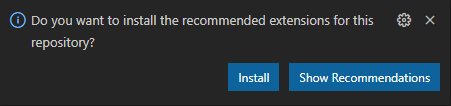
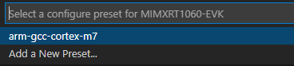

# Using Visual Studio Code with the NXP MIMXRT1060-EVK Evaluation Kit

This guide describes how to use Visual Studio Code to build, flash, and debug with the **NXP MIMXRT1060-EVK Evaluation Kit**.

This is a companion to the [Quickstart Guide](https://docs.microsoft.com/en-us/azure/iot-develop/quickstart-devkit-nxp-mimxrt1060-evk). Please ensure you have completed the following steps of the Quickstart Guide before continuing.

1.	[Clone the repo for the quickstart](https://docs.microsoft.com/en-us/azure/iot-develop/quickstart-devkit-nxp-mimxrt1060-evk#clone-the-repo-for-the-quickstart).

1.	[Create the cloud components](https://docs.microsoft.com/en-us/azure/iot-develop/quickstart-devkit-nxp-mimxrt1060-evk#create-the-cloud-components).

1.	[Configure Azure IoT connection settings](https://docs.microsoft.com/en-us/azure/iot-develop/quickstart-devkit-nxp-mimxrt1060-evk#add-configuration).

 _*Note: It is not necessary to install the tools described in the quickstart guide. Tool installation will be covered in the next section below.*_

## Configure Your Development Environment with `vcpkg-ce`

This section shows how to configure your development environment with the new `vcpkg-ce`, short for "configure environment", bootstraps project dependencies from a manifest file, `vcpkg-configuration.json`. This makes it easy to express which compilers and build tools are required by a project. Upon activation, the tools specified by the manifest are added to the path of the current shell. If the tools are not present, `vcpkg-ce` acquires them and installs them to a common location. The `vcpkg-ce` tool runs in user mode without elevation.

> `vcpkg-ce` is in early preview. To report problems or provide feedback, please open issues at https://github.com/microsoft/vcpkg-ce.

### Windows 10

1. Download and install [Visual Studio Code](https://code.visualstudio.com/download).

1. Download and install the [SEGGER J-Link Software and Documentation Pack](https://www.segger.com/downloads/jlink/#J-LinkSoftwareAndDocumentationPack) V7.00 or greater. _Note: Version V7.00 or greater is required to support the on-board DAPLink probe._

1. Open an Administrator PowerShell terminal and enable execution of PowerShell scripts.

    ```PowerShell
    Set-ExecutionPolicy -ExecutionPolicy RemoteSigned -Scope LocalMachine
    ```

1. Add the J-Link installation directory to the `Path` environment variable. Assuming you have chosen the default installation directory, you can do so by running the following command:

    ```PowerShell
    [Environment]::SetEnvironmentVariable("Path", $env:Path + ";C:\Program Files (x86)\SEGGER\JLink", "Machine")
    ```

1. Open a new PowerShell terminal and navigate to the following path in the repo.

    > *getting-started\NXP\MIMXRT1060-EVK*

1. Install `vcpkg-ce`.

    ```PowerShell
    iex (iwr -useb aka.ms/vcpkg-init.ps1)
    ```

1. Download, install, and activate developer tools.

    ```PowerShell
    vcpkg activate
    ```

1. Run the following code to confirm that CMake version 3.20 or later is installed.

    ```PowerShell
    cmake --version
    ```

1. Use this terminal to complete the remaining tasks in this guide.   

### Ubuntu 20.04

1. Download and install [Visual Studio Code](https://code.visualstudio.com/download).

1. Download and install the [SEGGER J-Link Software and Documentation Pack](https://www.segger.com/downloads/jlink/#J-LinkSoftwareAndDocumentationPack) V7.00 or greater. Choose the installer as appropriate for your Linux distribution. _Note: Version V7.00 or greater is required to support the on-board DAPLink probe._

1. Open a new bash terminal and navigate to the following path in the repo.

    > *getting-started\NXP\MIMXRT1060-EVK*

1. Install `curl` and `libncurses5` using your package manager.

    ```Shell
    sudo apt install curl libncurses5
    ```
  
1. Install `vcpkg-ce`.

    ```Shell
    . <(curl aka.ms/vcpkg-init.sh -L)
    ```

1. Download, install, and activate developer tools.

    ```Shell
    vcpkg activate
    ```

1. Ensure the following lines in *getting-started\NXP\MIMXRT1060-EVK\.vscode\tasks.json* have been commented out.

    ```jsonc
    // This must be commented out to run on Linux.
    // "options": {
    //     "shell": {
    //         "executable": "cmd.exe",
    //         "args": [ "/c" ]
    //     }
    // }
    ```

1. Run the following code to confirm that CMake version 3.20 or later is installed.

    ```Shell
    cmake --version
    ```

1. Use this terminal to complete the remaining tasks in this guide.   

## Using Visual Studio Code

1. Connect the Micro USB cable from the DevKit to your computer. If it is already connected, disconnect and reconnect it.

1. Launch Visual Studio Code from a PowerShell terminal.

    ```PowerShell
    code .
    ```

1. Accept the popup that appears in the lower right corner prompting you to install recommended extensions.

    

    If it does not appear, you can also invoke the “Extensions: Show Recommended Extensions” command from the Command Palette (`Ctrl-Shift-P`).

    > Completing this step will install the following extensions: [C/C++](https://marketplace.visualstudio.com/items?itemName=ms-vscode.cpptools) and [CMake Tools](https://marketplace.visualstudio.com/items?itemName=ms-vscode.cmake-tools).
 
1. If prompted for a Configure Preset, select "arm-gcc-cortex-m7".

    

1. If on the right side of the Status Bar, No Build Preset is selected:

    

    Click it and choose the "arm-gcc-cortex-m7" Build Preset.

1. Navigate to the Run and Debug view (`Ctrl-Shift-D`) and select the Launch configuration.

    

1. Press `F5` to start debugging the application. A dialog for the J-Link Terms of use may appear. Click the check box “Do not show this message again for today” and accept the terms of use if you agree.

    > Visual Studio Code will build and flash the application to the device, then pause the debugger at the application entry point.

1. Press `F5` to resume execution. The debugger is now running and connected the device.

## Restoring Your Development Environment

`vcpkg-ce` only modifies the path in the shell in which it is activated. If you close your shell and wish to restore the development environment in a future session:

1. Open a new PowerShell terminal.

1. Re-activate `vcpkg-ce`.

    ```Shell
    . ~/.vcpkg/vcpkg activate
    ```

1. Launch Visual Studio Code.

    ```Shell
    code .
    ```
