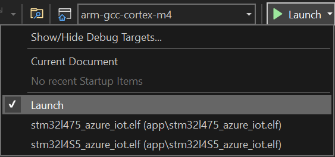

# Using Visual Studio with the STMicroelectronics B-L4S5I-IOTOA1 Discovery Kit

This guide describes how to use Visual Studio to build, flash, and debug with the **STMicroelectronics B-L4S5I-IOTOA1 Discovery Kit**.

This is a companion to the [Quickstart Guide](https://docs.microsoft.com/en-us/azure/iot-develop/quickstart-devkit-stm-b-l475e). Please ensure you have completed the following steps of the Quickstart Guide before continuing.

1.	[Clone the repo for the quickstart](https://docs.microsoft.com/en-us/azure/iot-develop/quickstart-devkit-stm-b-l475e#clone-the-repo-for-the-quickstart).

1.	[Create the cloud components](https://docs.microsoft.com/en-us/azure/iot-develop/quickstart-devkit-stm-b-l475e#create-the-cloud-components).

1.	[Configure Wi-Fi and Azure IoT connection settings](https://docs.microsoft.com/en-us/azure/iot-develop/quickstart-devkit-stm-b-l475e#add-configuration).

 _*Note: It is not necessary to install the tools described in the quickstart guide. Tool installation will be covered in the next section below.*_

## Configure Your Development Environment with `vcpkg-ce`

This section shows how to configure your development environment with the new `vcpkg-ce` tool: `ce`, short for "configure environment", bootstraps project dependencies from a manifest file, `vcpkg-configuration.json`. This makes it easy to express which compilers and build tools are required by a project. Upon activation, the tools specified by the manifest are added to the path of the current shell. If the tools are not present, `vcpkg-ce` acquires them and installs them to a common location. The `vcpkg-ce` tool runs in user mode without elevation.

> `vcpkg-ce` is in early preview. To report problems or provide feedback, please open issues at https://github.com/microsoft/vcpkg-ce.

### Windows 10

1. Download and install [Visual Studio](https://visualstudio.microsoft.com/downloads/).

1. Download and install the [ST-LINK Drivers](https://www.st.com/en/development-tools/stsw-link009.html). Restart your computer after installation is complete.

1. Open an Administrator PowerShell terminal and enable execution of PowerShell scripts.

    ```PowerShell
    Set-ExecutionPolicy -ExecutionPolicy RemoteSigned -Scope LocalMachine
    ```

1. Open a new PowerShell terminal and navigate to the following path in the repo.

    > *getting-started\STMicroelectronics\STM32L4_L4+*

1. Install `vcpkg-ce`.

    ```PowerShell
    iex (iwr -useb aka.ms/install-ce.ps1)
    ```

1. Download, install, and activate developer tools.

    ```PowerShell
    vcpkg activate
    ```

1. Run the following code to confirm that CMake version 3.20 or later is installed.

    ```PowerShell
    cmake --version
    ```

1. Use this terminal to complete the remaining tasks in this guide.   

## Using Visual Studio

1. Connect the Micro USB cable from the DevKit to your computer. If it is already connected, disconnect and reconnect it.

1. Launch Visual Studio from a PowerShell terminal.

    ```PowerShell
    start devenv .
    ```

    > Note that if you have more than one version of Visual Studio installed this may not launch the current preview. In that case you will need to use the full path to your preview installation. For example: 
    "C:\Program Files\Microsoft Visual Studio\2022\Preview\Common7\IDE\devenv"

1. Ensure that both the Configure Preset and the Build Preset are set to "arm-gcc-cortex-m4"
    
    

1. Ensure that the "Launch" target is selected as the Debug Target.
    
    

1. Press `F5` to start debugging the application.

    > Visual Studio will build and flash the application to the device, then pause the debugger at the application entry point.

1. Press `F5` to resume execution. The debugger is now running and connected the device.

## Restoring Your Development Environment

`vcpkg-ce` only modifies the path in the shell in which it is activated. If you close your shell and wish to restore the development environment in a future session:

1. Open a new PowerShell terminal.

1. Re-activate `vcpkg-ce`.

    ```Shell
    . ~/.vcpkg/vcpkg activate
    ```

1. Launch Visual Studio.

    ```Shell
    start devenv .
    ```
