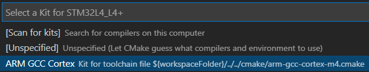
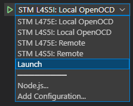

# Using Visual Studio Code with the STMicroelectronics B-L4S5I-IOTOA1 Discovery Kit

This guide describes how to use Visual Studio Code to build, flash, and debug with the **STMicroelectronics B-L4S5I-IOTOA1 Discovery Kit**.

This is a companion to the [Quickstart Guide](https://docs.microsoft.com/en-us/azure/iot-develop/quickstart-devkit-stm-b-l475e). Please ensure you have completed the following steps of the Quickstart Guide before continuing.

1.	[Clone the repo for the quickstart](https://docs.microsoft.com/en-us/azure/iot-develop/quickstart-devkit-stm-b-l475e#clone-the-repo-for-the-quickstart).

1.	[Create the cloud components](https://docs.microsoft.com/en-us/azure/iot-develop/quickstart-devkit-stm-b-l475e#create-the-cloud-components).

1.	[Configure Wi-Fi and Azure IoT connection settings](https://docs.microsoft.com/en-us/azure/iot-develop/quickstart-devkit-stm-b-l475e#add-configuration).

 _*Note: It is not necessary to install the tools described in the quickstart guide. Tool installation will be covered in the next section below.*_

## Configure Your Development Environment with vcpkg `ce`

This section shows how to configure your development environment with the new vcpkg `ce` tool: `ce`, short for "configure environment", bootstraps project dependencies from a manifest file, `environment.yaml`. This makes it easy to express which compilers and build tools are required by a project. Upon activation, the tools specified by the manifest are added to the path of the current shell. If the tools are not present, `ce` acquires them and installs them to a common location. The `ce` tool runs in user mode without elevation.

> `ce` is in early preview prior to being integrated as a part of `vcpkg`. To report problems or provide feedback, please open issues at https://github.com/microsoft/vcpkg-ce.

### Windows 10

1. Download and install [Visual Studio Code](https://code.visualstudio.com/download).

1. Download and install the [ST-LINK Drivers](https://www.st.com/en/development-tools/stsw-link009.html). Restart your computer after installation is complete.

1. Open an Administrator PowerShell terminal and enable execution of PowerShell scripts.

    ```PowerShell
    Set-ExecutionPolicy -ExecutionPolicy RemoteSigned -Scope LocalMachine
    ```

1. Open a new PowerShell terminal and navigate to the following path in the repo.

    > *getting-started\STMicroelectronics\STM32L4_L4+*

1. Install `ce`.

    ```PowerShell
    iex (iwr -useb aka.ms/install-ce.ps1)
    ```

1. Review the end-user license agreement at https://aka.ms/vcpkg-ce-eula.txt. Run the following command to accept.

    ```PowerShell
    ce --accept-eula
    ```

1. Download, install, and activate developer tools.

    ```PowerShell
    ce activate
    ```

1. Run the following code to confirm that CMake version 3.20 or later is installed.

    ```PowerShell
    cmake --version
    ```

1. Use this terminal to complete the remaining tasks in this guide.   

### Ubuntu 20.04

1. Download and install [Visual Studio Code](https://code.visualstudio.com/download).

1. Open a new bash terminal and navigate to the following path in the repo.

    > *getting-started\STMicroelectronics\STM32L4_L4+*

1. Create `/etc/udev/rules.d/99-stm32l4.rules` to permit non-root access to the device.

    ```Shell
    echo -e 'SUBSYSTEMS=="usb", ATTRS{idVendor}=="0483", ATTRS{idProduct}=="374b", MODE:="0666"\nKERNEL=="ttyACM*", ATTRS{idVendor}=="0483", ATTRS{idProduct}=="374b", MODE:="0666"' | sudo tee /etc/udev/rules.d/99-stm32l4.rules
    ```

1. Install `curl` and `libncurses5` using your package manager.

    ```Shell
    sudo apt install curl libncurses5
    ```

1. Install `ce`.

    ```Shell
    . <(curl aka.ms/install-ce.sh -L)
    ```

1. Review the end-user license agreement at https://aka.ms/vcpkg-ce-eula.txt. Run the following command to accept.

    ```Shell
    ce --accept-eula
    ```

1. Download, install, and activate developer tools.

    ```Shell
    ce activate
    ```

1. Ensure the following lines in *getting-started\STMicroelectronics\STM32L4_L4+\.vscode\tasks.json* have been commented out:

    ```jsonc
    // This must be commented out to run on Linux.
    // "options": {
    //     "shell": {
    //         "executable": "cmd.exe",
    //         "args": [ "/c" ]
    //     }
    // }
    ```

1. Run the following code to confirm that CMake version 3.20 or later is installed.

    ```Shell
    cmake --version
    ```

1. Use this terminal to complete the remaining tasks in this guide.   

## Using Visual Studio Code

1. Connect the Micro USB cable from the DevKit to your computer. If it is already connected, disconnect and reconnect it.

1. Launch Visual Studio Code.

    ```Shell
    code .
    ```

1. Accept the popup that appears in the lower right corner prompting you to install recommended extensions.

    

    If it does not appear, you can also invoke the “Extensions: Show Recommended Extensions” command from the Command Palette (`Ctrl-Shift-P`).

    > Completing this step will install the following extensions: [C/C++](https://marketplace.visualstudio.com/items?itemName=ms-vscode.cpptools) and [CMake Tools](https://marketplace.visualstudio.com/items?itemName=ms-vscode.cmake-tools).

1. If prompted for a CMake kit, select "ARM GCC Cortex".

    

1. Navigate to the Run and Debug view (`Ctrl-Shift-D`) and select the Launch configuration.

    

1. Press `F5` to start debugging the application.

    > Visual Studio Code will build and flash the application to the device, then pause the debugger at the application entry point.

1. Press `F5` to resume execution. The debugger is now running and connected the device.

## Restoring Your Development Environment

`ce` only modifies the path in the shell in which it is activated. If you close your shell and wish to restore the development environment in a future session:

1. Open a new terminal.

1. Re-activate `ce`.

    ```Shell
    . ~/.ce/ce activate
    ```

1. Launch Visual Studio Code.

    ```Shell
    code .
    ```
