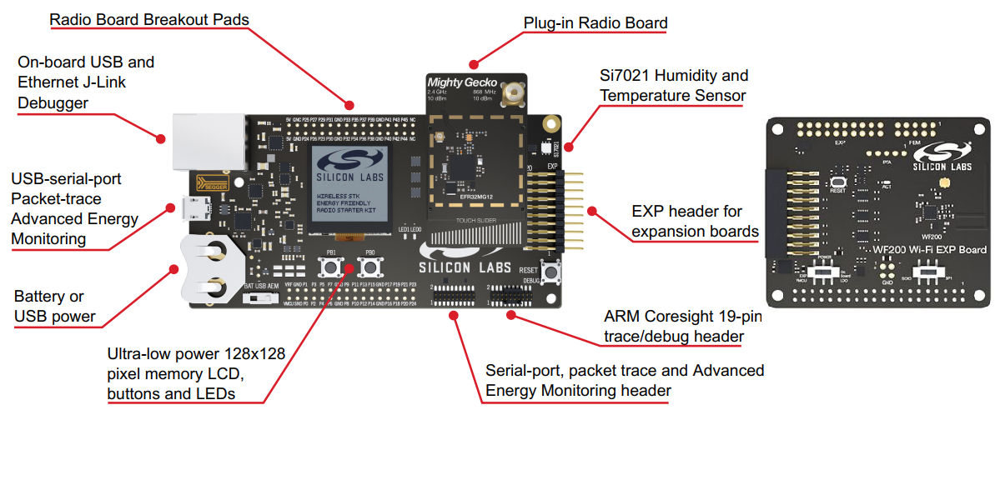
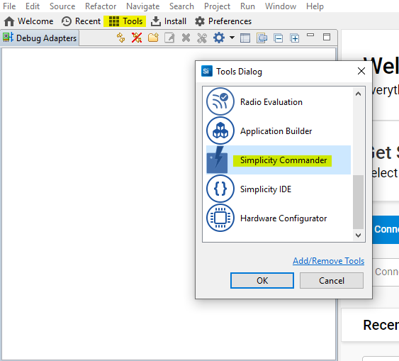
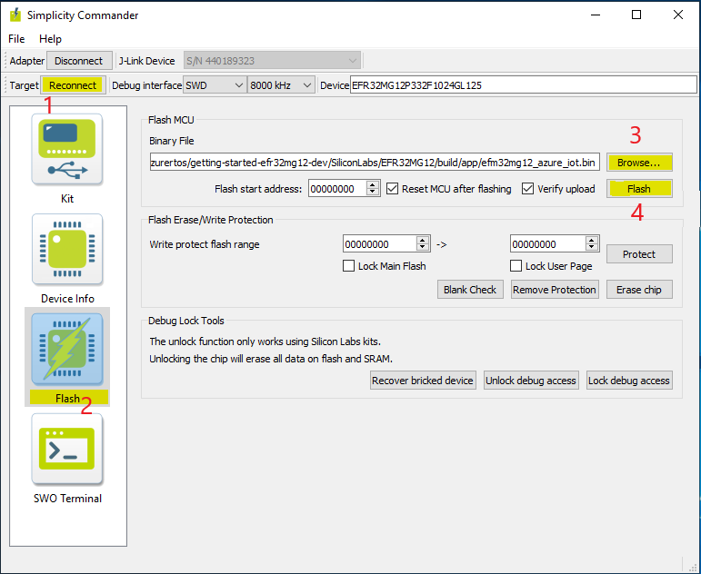
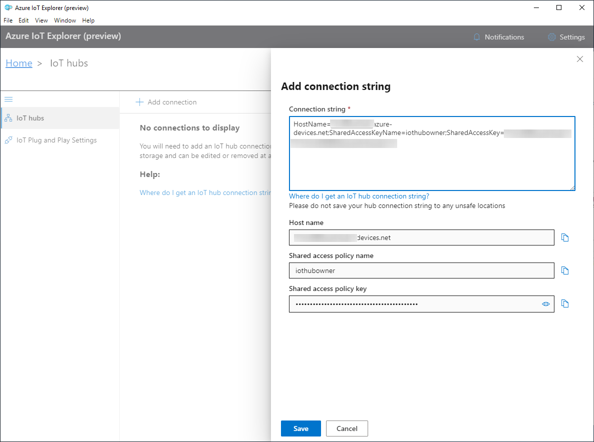
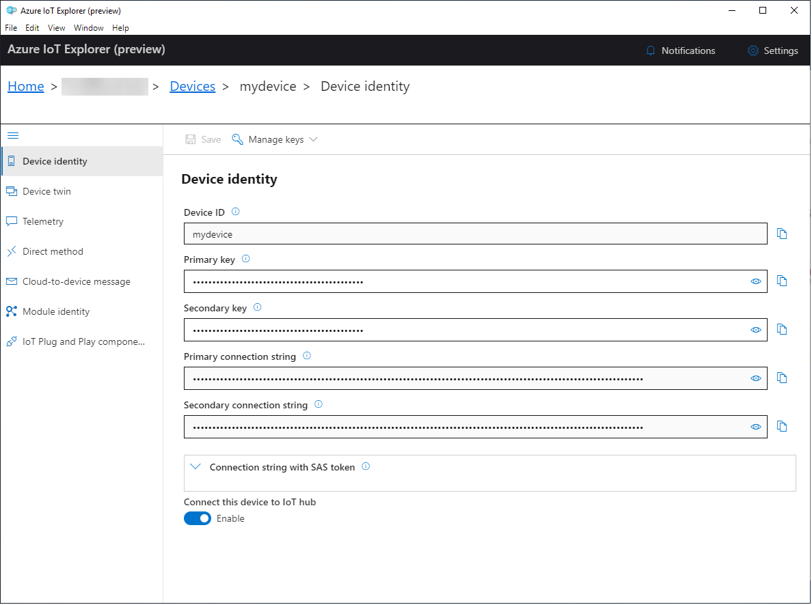
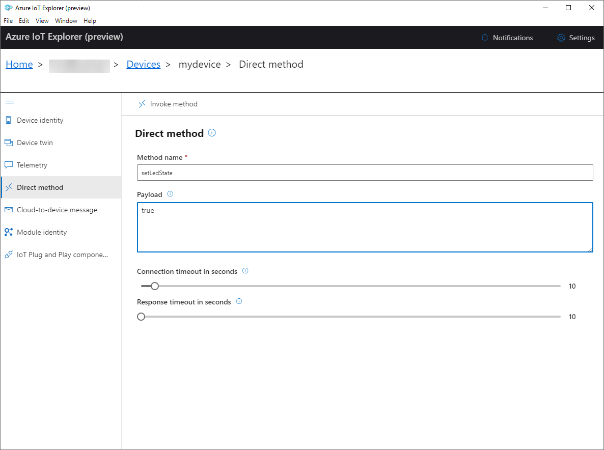

<h1>Getting started with the Silicon Labs SLWSTK6000B EFR32MG12 Starter Kit</h1>

**Total completion time**:  30 minutes

In this tutorial you use Azure RTOS to connect the Silicon Labs EFR32MG12 MCU Starter Kit to Azure IoT. The article is part of the series [Getting started with Azure RTOS](https://go.microsoft.com/fwlink/p/?linkid=2129824). The series introduces device developers to Azure RTOS, and shows how to connect several device evaluation kits to Azure IoT. 

You will complete the following tasks:

* Install a set of embedded development tools for programming the EFR32MG12 MCU Starter Kit in C
* Build an image and flash it onto the EFR32MG12 MCU Starter Kit
* Use Azure CLI to create and manage an Azure IoT hub that the EFR32MG12 MCU Starter Kit will securely connect to
* Use Azure IoT Explorer to view properties, view device telemetry, and call cloud-to-device (c2d) methods

## Prerequisites

* A PC running Microsoft Windows (Windows 10 recommended)
* If you don't have an Azure subscription, [create one for free](https://azure.microsoft.com/free/?WT.mc_id=A261C142F) before you begin.
* [Git](https://git-scm.com/downloads)
* [Simplicity Studio v5](https://www.silabs.com/developers/simplicity-studio)
* Hardware

    > * Silicon Labs Starter Kit: [SLWSTK6000B](https://www.silabs.com/development-tools/wireless/zigbee/efr32mg-zigbee-thread-starter-kit)
    > * Wi-Fi 2.4 GHz
    > * USB Mini-B male to USB male cable

## Prepare the development environment

To set up your development environment, first you clone a GitHub repo that contains all the assets you need for the tutorial. Then you install a set of programming tools.

### Clone the repo for the tutorial

Azure RTOS for Silicon Labs MCU contains two source code parts. The source code developed by Microsoft in Azure RTOS repo and the source code developed by Silicon Labs in Silicon Labs repo. To prepare complete source code for tutorial, you need to clone the Azure RTOS repo repo and unpack the zip as below.

Run the following command to clone the source code from Azure RTOS repo:

```
git clone --recursive https://github.com/azure-rtos/getting-started.git
cd getting-started
git checkout azrtos_v6.1.0
```

Unpack the  Silicon Labs code into the getting-started folder.

After clone abd unpacking, all sample device code, setup scripts, and offline versions of the documentation for Silicon Labs MCU are located in `getting-started\SiliconLabs`.

### Install programming tools

The cloned repo contains a setup script that installs and configures the required tools. If you installed these tools in another tutorial in the getting started guide, you don't need to do it again.

> Note: The setup script installs the following tools:
> * [GCC](https://developer.arm.com/tools-and-software/open-source-software/developer-tools/gnu-toolchain/gnu-rm): Compile
> * [CMake](https://cmake.org): Build
> * [Termite](https://www.compuphase.com/software_termite.htm): Monitor COM port output for connected devices
> * [Azure IoT Explorer](https://github.com/Azure/azure-iot-explorer/releases): Cross-platform utility to  monitor and manage Azure IoT resources (Tool will be used in next development phase)

To run the setup script:

1. Open a console app with administrator privileges, go to the following path in the repo, and run the setup script named *get-toolchain.bat*. If you use File Explorer, right-click the file and select **Run As Administrator**.

    > *getting-started\tools\get-toolchain.bat*

1. After the installation, open a new console window to recognize the configuration changes made by the setup script. Use this console to complete the remaining programming tasks in the tutorial. You can use Windows CMD, Powershell, or Git Bash for Windows.
1. Run the following code to confirm that CMake version 3.14 or later is installed.

    ```
    cmake --version
    ```
## Prepare Azure resources

To prepare Azure cloud resources and connect a device to Azure, you can use Azure CLI. There are two ways to access the Azure CLI: by using the Azure Cloud Shell, or by installing Azure CLI locally.  Azure Cloud Shell lets you run the CLI in a browser so you don't have to install anything.

Use one of the following options to run Azure CLI.  

If you prefer to run Azure CLI locally:

1. If you already have Azure CLI installed locally, run `az --version` to check the version. This tutorial requires Azure CLI 2.10.1 or later.
1. To install or upgrade, see [Install Azure CLI](https://docs.microsoft.com/cli/azure/install-azure-cli?view=azure-cli-latest). If you install Azure CLI locally, you can run CLI commands in the GCC Command Prompt, Git Bash for Windows, or PowerShell.

If you prefer to run Azure CLI in the browser-based Azure Cloud Shell:

1. Use your Azure account credentials to sign into the Azure Cloud shell at https://shell.azure.com/.
    > Note: If this is the first time you've used the Cloud Shell, it prompts you to create storage, which is required to use the Cloud Shell.  Select a subscription to create a storage account and Microsoft Azure Files share.
1. Select Bash or PowerShell as your preferred CLI environment in the **Select environment** dropdown. If you plan to use Azure Cloud Shell, keep your browser open to run the Azure CLI commands in this tutorial.

    
### Create an IoT hub

You can use Azure CLI to create an IoT hub that handles events and messaging for your device.

To create an IoT hub:

1. In your CLI console, run the [az extension add](https://docs.microsoft.com/cli/azure/extension?view=azure-cli-latest#az-extension-add) command to add the Microsoft Azure IoT Extension for Azure CLI to your CLI shell. The IOT Extension adds IoT Hub, IoT Edge, and IoT Device Provisioning Service (DPS) specific commands to Azure CLI.

   ```shell
   az extension add --name azure-iot
   ```

1. Run the [az group create](https://docs.microsoft.com/cli/azure/group?view=azure-cli-latest#az-group-create) command to create a resource group. The following command creates a resource group named *MyResourceGroup* in the *centralus* region.

    ```shell
    az group create --name MyResourceGroup --location centralus
    ```

1. Run the [az iot hub create](https://docs.microsoft.com/cli/azure/iot/hub?view=azure-cli-latest#az-iot-hub-create) command to create an IoT hub. It might take a few minutes to create an IoT hub.

    *YourIotHubName*. Replace this placeholder below with the name you chose for your IoT hub. An IoT hub name must be globally unique in Azure. This placeholder is used in the rest of this tutorial to represent your unique IoT hub name.

    ```shell
    az iot hub create --resource-group MyResourceGroup --name {YourIoTHubName}
    ```

1. After the IoT hub is created, view the JSON output in the console, and copy the `hostName` value to a safe place. You use this value in a later step. The `hostName` value looks like the following example:

    `{Your IoT hub name}.azure-devices.net`

### Register a device

In this section, you create a new device instance and register it with the Iot hub you created. You will use the connection information for the newly registered device to securely connect your physical device in a later section.

To register a device:

1. In your console, run the [az iot hub device-identity create](https://docs.microsoft.com/cli/azure/ext/azure-cli-iot-ext/iot/hub/device-identity?view=azure-cli-latest#ext-azure-cli-iot-ext-az-iot-hub-device-identity-create) command. This creates the simulated device identity.

    *YourIotHubName*. Replace this placeholder below with the name you chose for your IoT hub.

    *mydevice*. You can use this name directly for the device in CLI commands in this tutorial. Optionally, use a different name.

    ```shell
    az iot hub device-identity create --device-id mydevice --hub-name {YourIoTHubName}
    ```

1. After the device is created, view the JSON output in the console, and copy the `deviceId` and `primaryKey` values to use in a later step.

Confirm that you have the copied the following values from the JSON output to use in the next section:

> * `hostName`
> * `deviceId`
> * `primaryKey`

## Prepare the device

To connect the EFR32MG12 MCU Starter Kit to Azure, you'll modify a configuration file for Wi-Fi and Azure IoT settings, rebuild the image, and flash the image to the device.

### Add configuration

1. In a text editor, edit the file *getting-started\SiliconLabs\EFR32MG12\app\azure_config.h* to set the Wi-Fi constants to the following values from your local environment.

    |Constant name|Value|
    |-------------|-----|
    |`WIFI_SSID` |{*Your Wi-Fi ssid*}|
    |`WIFI_PASSWORD` |{*Your Wi-Fi password*}|
    |`WIFI_MODE` |{*One of the enumerated Wi-Fi mode values in enum sl_wfx_security_mode_t.*}|

1. Edit the same file to set the Azure IoT device information constants to the values that you saved after you created Azure resources.

    |Constant name|Value|
    |-------------|-----|
    |`IOT_HUB_HOSTNAME` |{*Your Iot hub hostName value*}|
    |`IOT_DEVICE_ID` |{*Your deviceID value*}|
    |`IOT_PRIMARY_KEY` |{*Your primaryKey value*}|

### Build the image

In your console or in File Explorer, run the script *rebuild.bat* at the following path to build the image:

> *getting-started\SiliconLabs\EFR32MG12\tools\rebuild.bat*

After the build completes, confirm that the image files were created in two paths.

The first path below, it includes application image that connect to Azure IoT.

> *getting-started\SiliconLabs\EFR32MG12\build\app\efm32mg12_azure_iot.bin*

The second path that contains test cases image files as below:

> *getting-started\SiliconLabs\EFR32MG12\build\test\\\*.bin*

Follow description in test specification *getting-started\SiliconLabs\EFR32MG12\test\AzureRTOS_TestSpecification.xlsx* to run above test cases. The following sections only show how to connect the Silicon Labs EFR32MG12 MCU Starter Kit to Azure IoT.


### Set up your Kit

1. Plug in the Mighty Gecko radio board

1. Plug in the WF200 Wi-Fi EXP Board

1. Ensure that the power selector switch on the EFR32MG12 MCU Starter Kit is in the [AEM] position.

1. Ensure the WF200 EXP Board is switched to SPI mode

1. Provide power by connecting the [DBG] USB connector on the Starter Kit to the PC using the provided USB cable.



### Flash the image

1. Click  **[Tools]** on toolbar of Simplicity Studio to open Simplicity Commander.

    

1. Connect EFR32MG12 MCU Starter Kit to the PC using the USB Mini-B cable.

1. Simplicity Commander opens in a disconnected state. Click **[Connect]** to connect to the target device, then click **[Flash]** icon as step 1, 2 in image below.

1. Browse to the image file (**efm32mg12_azure_iot.bin**) that you created in the previous section, and click **[Flash]** button on Simplicity Commander Window as step 3, 4 in image bellow. The flashing process starts automatically.

    


### Confirm device connection details

You can use the **Termite** utility to monitor communication and confirm that your device is set up correctly.
> Note: If you have issues getting your device to initialize or connect after flashing, see [Troubleshooting](../../docs/troubleshooting.md).

1. Start **Termite**.
1. Select **Settings**.
1. In the **Serial port settings** dialog, check the following settings and update if needed:
    * **Baud rate**: 115,200
    * **Port**: The port that your EFR32MG12 MCU Starter Kit is connected to. If there are multiple port options in the dropdown, you can find the correct port to use. Open Windows **Device Manager**, and view **Ports** to identify which port to use.

    
1. Select OK.
1. Press the **Reset** button on the device.
1. In the **Termite** console, check the following checkpoint values to confirm that the device is initialized and connected to Azure IoT.

    |Checkpoint name|Output value|
    |---------------|-----|
    |DHCP |SUCCESS: DHCP initialized|
    |DNS |SUCCESS: DNS client initialized|
    |SNTP |SUCCESS: SNTP initialized|
    |MQTT |SUCCESS: MQTT Hub client initialized|

    The Termite console shows the details about the device, your connection, and the checkpoint values.

    ```output
    Starting Azure thread
    WF200 Firmware version 3.7.0
    WF200 initialization successful
    Connecting to SSID: Azure_RTOS
    Connected
    Initializing DHCP
        IP address: 192.168.43.220
        Mask: 255.255.255.0
        Gateway: 192.168.43.1
    SUCCESS: DHCP initialized

    Initializing DNS client
        DNS address: 192.168.43.1
    SUCCESS: DNS client initialized

    Initializing SNTP client
        SNTP server 0.pool.ntp.org
        SNTP IP address: 162.159.200.123
        SNTP time update: Jan 27, 2021 8:36:26.355 UTC 
    SUCCESS: SNTP initialized 

    Initializing MQTT Hub client
        Hub hostname: ***
        Device id: ***
        Model id: dtmi:com:example:azurertos:gsg;1
    SUCCESS: MQTT Hub client initialized

    Sending device twin update with bool value
    Sending message {"ledState":false}
    Requesting device twin model
    Starting MQTT loop
    ```

Keep Termite open to monitor device output in subsequent steps.

## View device properties

You can use the Azure IoT Explorer to view and manage the properties of your devices. In the following steps, you'll add a connection to your IoT hub in IoT Explorer. With the connection, you can view properties for devices associated with the IoT hub. Optionally, you can perform the same task using Azure CLI.

To add a connection to your IoT hub:

1. In your CLI console, run the [az iot hub show-connection-string](https://docs.microsoft.com/en-us/cli/azure/iot/hub?view=azure-cli-latest#az-iot-hub-show-connection-string) command to get the connection string for your IoT hub.

    ```shell
    az iot hub show-connection-string --name {YourIoTHubName}
    ```

1. Copy the connection string without the surrounding quotation characters.
1. In Azure IoT Explorer, select **IoT hubs > Add connection**.
1. Paste the connection string into the **Connection string** box.
1. Select **Save**.

    

If the connection succeeds, the Azure IoT Explorer switches to a **Devices** view and lists your device.

To view device properties using Azure IoT Explorer:

1. Select the link for your device identity. IoT Explorer displays details for the device.

    

1. Inspect the properties for your device in the **Device identity** panel.

To use Azure CLI to view device properties:

1. Run the [az iot hub device-identity show](https://docs.microsoft.com/en-us/cli/azure/ext/azure-iot/iot/hub/device-identity?view=azure-cli-latest#ext-azure-iot-az-iot-hub-device-identity-show) command.

    ```shell
    az iot hub device-identity show --device-id mydevice --hub-name {YourIoTHubName}
    ```

1. Inspect the properties for your device in the console output.

## View device telemetry

With Azure IoT Explorer, you can view the flow of telemetry from your device to the cloud. Optionally, you can perform the same task using Azure CLI.

To view telemetry in Azure IoT Explorer:

1. In IoT Explorer select **Telemetry**. Confirm that **Use built-in event hub** is set to *Yes*.
1. Select **Start**.
1. View the telemetry as the device sends messages to the cloud.

    

    Note: You can also monitor telemetry from the device by using the Termite terminal.

1. Select **Stop** to end receiving events.

To use Azure CLI to view device telemetry:

1. In your CLI console, run the [az iot hub monitor-events](https://docs.microsoft.com/en-us/cli/azure/ext/azure-iot/iot/hub?view=azure-cli-latest#ext-azure-iot-az-iot-hub-monitor-events) command. Use the names that you created previously in Azure IoT for your device and IoT hub.

    ```shell
    az iot hub monitor-events --device-id mydevice --hub-name {YourIoTHubName}
    ```

1. View the JSON output in the console.

    ```json
    {
        "event": {
            "origin": "mydevice",
            "module": "",
            "interface": "dtmi:com:example:azurertos:gsg;1",
            "component": "",
            "payload": "{\"temperature\":25.10}"
        }
    }
    ```

1. Select CTRL+C to end monitoring.

## Call a direct method on the device

You can also use Azure IoT Explorer to call a direct method that you have implemented on your device. Direct methods have a name, and can optionally have a JSON payload, configurable connection, and method timeout. In this section, you call a method that enables you to turn an LED on or off. Optionally, you can perform the same task using Azure CLI.

To call a method in Azure IoT Explorer:

1. Select **Direct method**.
1. In the **Direct method** panel add the following values for the method name and payload. The payload value *true* indicates to turn the LED on.
    * **Method name**: `setLedState`
    * **Payload**: `true`
1. Select **Invoke method**. The LED light should turn on.

    
1. Change **Payload** to *false*, and again select **Invoke method**. The LED light should turn off.
1. Optionally, you can view the output in Termite to monitor the status of the methods.

To use Azure CLI to call a method:

1. Run the [az iot hub invoke-device-method](https://docs.microsoft.com/en-us/cli/azure/ext/azure-iot/iot/hub?view=azure-cli-latest#ext-azure-iot-az-iot-hub-invoke-device-method) command, and specify the method name and payload. For this method, setting `method-payload` to `true` turns the LED on, and setting it to `false` turns it off.

    <!-- Inline code tag and CSS to wrap long code lines. -->
    <code style="white-space : pre-wrap !important;">
    az iot hub invoke-device-method --device-id mydevice --method-name setLedState --method-payload true --hub-name {YourIoTHubName}
    </code>

    The CLI console shows the status of your method call on the device, where `200` indicates success.

    ```json
    {
      "payload": {},
      "status": 200
    }
    ```

1. Check your device to confirm the LED state.

1. View the Termite terminal to confirm the output messages:

    ```output
    Received direct method=setLedState, rid=1, message=true
    Direct method=setLedState invoked
    LED is turned ON
    Responding to direct command property with status:200, rid:1
    Sending device twin update with bool value
    Sending message {"ledState":true}
    Processed device twin update response with status=204
    ```

## Clean up resources

If you no longer need the Azure resources created in this tutorial, you can use the Azure CLI to delete the resource group and all the resources you created for this tutorial. Optionally, you can use Azure IoT Explorer to delete individual resources including devices and IoT hubs.

If you continue to another tutorial in this getting started guide, you can keep the resources you've already created and reuse them.

> **Important**: Deleting a resource group is irreversible. The resource group and all the resources contained in it are permanently deleted. Make sure that you do not accidentally delete the wrong resource group or resources.

To delete a resource group by name:
1. Run the [az group delete](https://docs.microsoft.com/cli/azure/group?view=azure-cli-latest#az-group-delete) command. This removes the resource group, the IoT Hub, and the device registration you created.

    ```shell
    az group delete --name MyResourceGroup
    ```

1. Run the [az group list](https://docs.microsoft.com/cli/azure/group?view=azure-cli-latest#az-group-list) command to confirm the resource group is deleted.  

    ```shell
    az group list
    ```

## Next Steps

In this tutorial you built a custom image that contains Azure RTOS sample code, and then flashed the image to the EFR32MG12 MCU Starter Kit. You also used the Azure CLI to create Azure resources, connect the EFR32MG12 MCU Starter Kit securely to Azure, view telemetry, and send messages.

* For device developers, the suggested next step is to see the other tutorials in the series [Getting started with Azure RTOS](https://go.microsoft.com/fwlink/p/?linkid=2129824).
* If you have issues getting your device to initialize or connect after following the steps in this guide, see [Troubleshooting](../../docs/troubleshooting.md).
* To learn more about how Azure RTOS components are used in the sample code for this tutorial, see [Using Azure RTOS in the Getting Started Guides](../../docs/using-azure-rtos.md).
