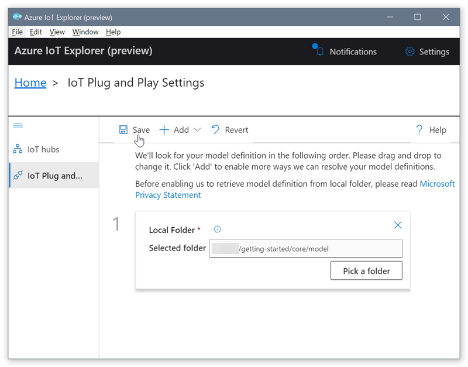
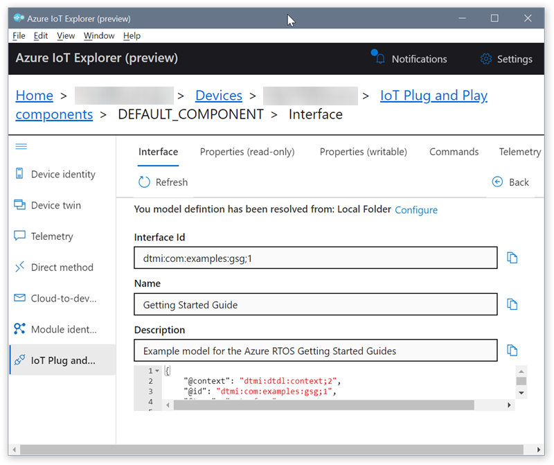
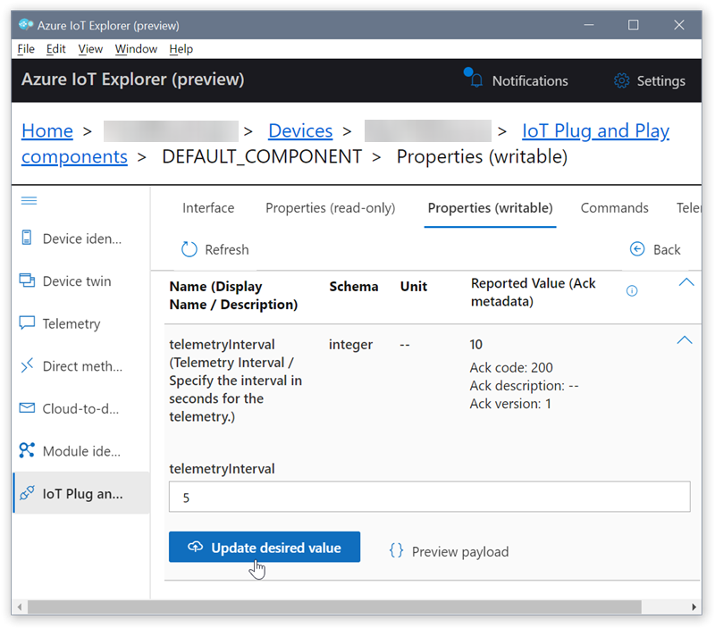
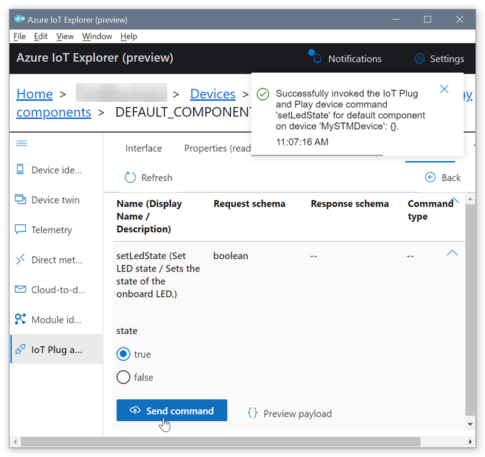

# Using IoT Plug and Play with Azure RTOS

## Introduction

The [Azure RTOS Getting Started guide](../README.md) code sample includes a feature called IoT Plug and Play. The current tutorials in the guide don't show you how to use this feature. Instead, they demonstrate a more manual process of interacting with the device, using Azure IoT Explorer or Azure CLI. In contrast, IoT Plug and Play provides an open device model that lets applications programmatically query a device's capabilities and interact with it. A device uses this model to broadcast its capabilities to an IoT Plug and Play-enabled application. By using this model, you can streamline and enhance the tasks of adding, configuring, and managing devices. For more information see the [IoT Plug and Play documentation](https://docs.microsoft.com/azure/iot-pnp/).

To use IoT Plug and Play with your device, follow the steps in this article. The device model lets IoT Explorer automatically generate a UI based on the device's properties. You'll use IoT Explorer to view the device's properties and telemetry, call a direct method, and modify a writeable property.

## Prerequisites

To use IoT Plug and Play with your device, you must first complete several setup steps in one of the tutorials in the [Azure RTOS Getting Started guide](../README.md). Each tutorial walks you through the initial setup for your device. Then you'll have the option to either continue the tutorial, or browse to this article and complete the tutorial using IoT Plug and Play.

**Important**:  IoT Plug and Play is currently available only on IoT hubs created in the Central US, North Europe, and East Japan regions. The Azure RTOS Getting Started guide shows how to create a resource group in the `centralus` region.

## Setup

In this section you configure IoT Explorer to add an IoT Plug and Play device model. Adding the model enables IoT Explorer to interact with the IoT Plug and Play components on compatible devices. If you have completed any tutorial in the [Azure RTOS Getting Started guide](../README.md), the code sample that you built enabled your device for IoT Plug and Play.

To add a device model to IoT Explorer:

1. Confirm that the device you used for the tutorial is flashed, booted up, and connected to the Iot hub you created.
1. Open IoT Explorer.
1. Navigate to **Home**.
1. Select **IoT Plug and Play Settings**.
1. Select **Add > Local folder**.
1. Select **Pick a folder**.
1. Browse to */getting-started/core/model*. The folder contains a device model configuration file.
1. Click **Select**.
1. Select **Save**.

    

## Access the IoT Plug and Play components

To access the IoT Plug and Play components on your device:

1. Select **IoT hubs > View devices in this hub**.
1. Select your device.
1. Select **IoT Plug and Play components**.
1. Select **Default component**. IoT Explorer displays the IoT Plug and Play components that are implemented on your device.

    

1. On the **Interface** tab, view the JSON content in the device model **Description**. The JSON contains configuration details for each of the IoT Plug and Play components in the device model.

    Each tab in IoT Explorer corresponds to one of the IoT Plug and Play components in the device model.

    | Tab | Type | Name | Description |
    |---|---|---|---|
    | **Interface** | Interface | `Getting Started Guide` | Example model for the Azure RTOS Getting Started Guides |
    | **Properties (read-only)** | Property | `ledState` | The current state of the LED |
    | **Properties (writable)** | Property | `telemetryInterval` | The interval that the device sends telemetry |
    | **Commands** | Command | `setLedState` | Enable or disable the LED |
    | **Telemetry** | Telemetry | `temperature` | The temperature in celsius |

## View device properties

To view device properties:

1. Select the **Properties (read-only)** tab. It displays the current state of the LED on your connected device.
1. Select the **Properties (writable)** tab. It displays the interval that telemetry is sent.
1. Change the `telemetryInterval` to *5*, and then select **Update desired value**. Your device now uses this interval to send telemetry.

    

## View device telemetry

To view device telemetry:

1. Select the **Telemetry** tab. Confirm that **Use built-in event hub** is enabled.
1. Select **Start**. IoT Explorer displays telemetry using the interval you set previously.

    ```json
    10:51:23 AM, 08/13/2020:
    {
        "body": {
        "temperature": 30.17
        },
        "enqueuedTime": "2020-08-13T17:51:23.994Z",
        "properties": {}
    }
    10:51:18 AM, 08/13/2020:
    {
        "body": {
        "temperature": 30.17
        },
        "enqueuedTime": "2020-08-13T17:51:18.790Z",
        "properties": {}
    }
    ```

1. Select **Show modeled events**. IoT Explorer should display the telemetry as defined in the device model. In this case, the telemetry is temperature. The device sensor captures the temperature and sends it in the data format specified by the model, and at the interval you specified in the `telemetryInterval` property.

    | Enqueue time | Name | Schema | Unit | Value |
    |---|---|---|---|---|
    | 10:58:40 AM, 08/13/2020 | temperature (Temperature) | double | degree celsius (°C) | { "temperature": 30.23 } |
    | 10:58:35 AM, 08/13/2020 | temperature (Temperature) | double | degree celsius (°C) | { "temperature": 30.21 } |

## Call a direct method on the device

To call a direct method on the connected device:

1. Select the **Commands** tab.
1. For the `setLedState` command, set **state** to *true*.
1. Select **Send command**. Confirm that the LED is enabled. IoT Explorer raises a notification that you successfully called the method on the device.

    

1. Select the **Properties (read-only)** tab.
1. Select **Refresh**. Confirm that **Value** for the LED is *true*.
1. Return to the **Commands** tab and for the `setLedState` command, set **state** to *false*.
1. Select **Send command**. Confirm that the LED is disabled.
1. Select the **Properties (read-only)** tab.
1. Select **Refresh**. Confirm that **Value** for the LED is *false*.


## Next Steps

In this tutorial you used Azure IoT Explorer to work with an IoT Plug and Play enabled device. You used IoT Explorer to add an IoT Plug and Play device model. Then you used the UI generated by IoT Explorer to interact with device properties, view telemetry, and invoke a direct method to toggle the LED.

* To continue learning about Azure RTOS, return to the tutorial you started with in the [Azure RTOS Getting Started guide](../README.md). You can optionally learn how to perform the same tasks you completed in this tutorial, but without using IoT Plug and Play. The tutorials also provide directions to clean up IoT resources that you created for the sample application.
* To learn more about IoT Plug and Play, see the [IoT Plug and Play documentation](https://docs.microsoft.com/azure/iot-pnp/).
